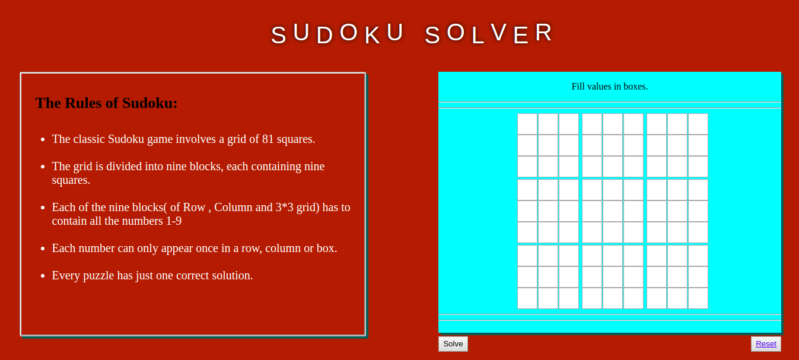
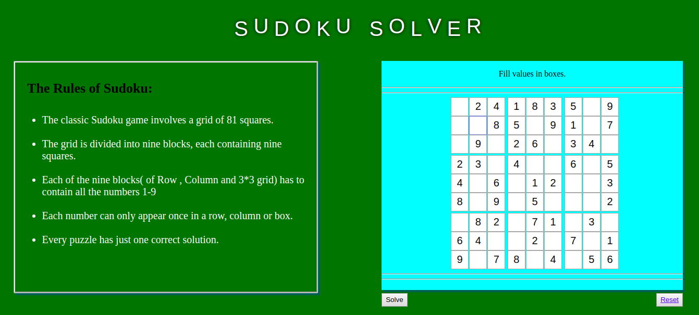
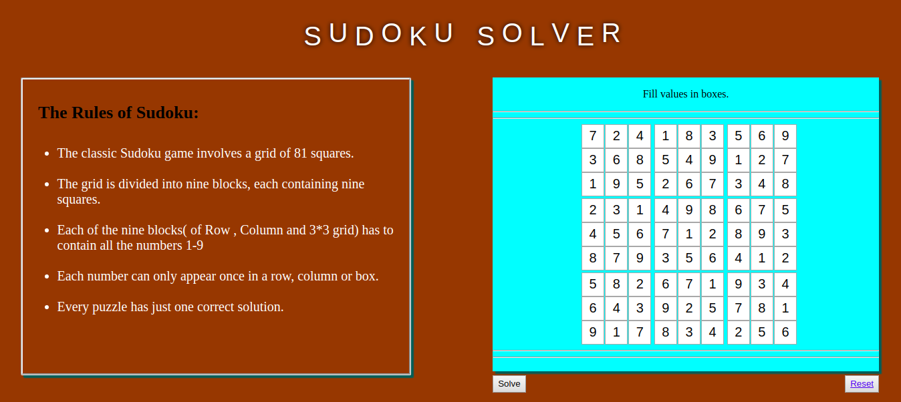

# Sudoku Solver
Algorithm tries to find best possible number in each box and recursively tries same for next adjacent box. If number in current box is violating any sudoku rule then algorithm will backtrack till the satisfying solution and again try with another number in next adjacent box.

# Interface

</img>
</img>
</img>
